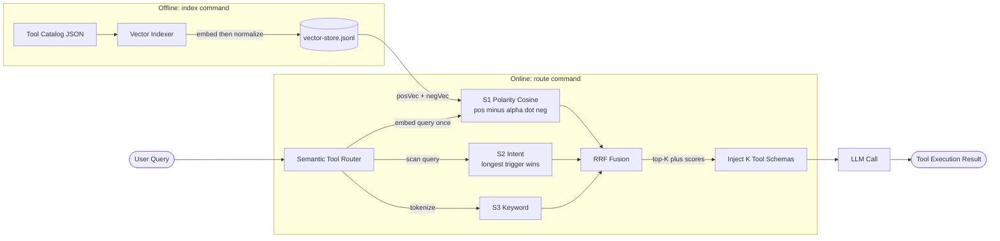
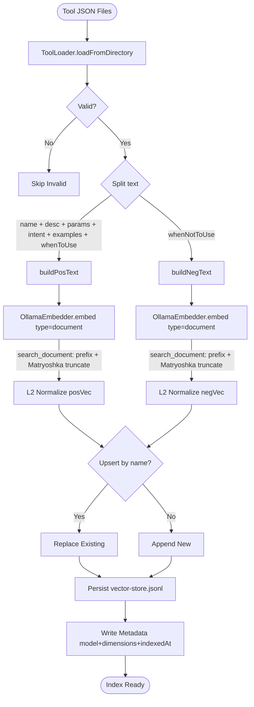
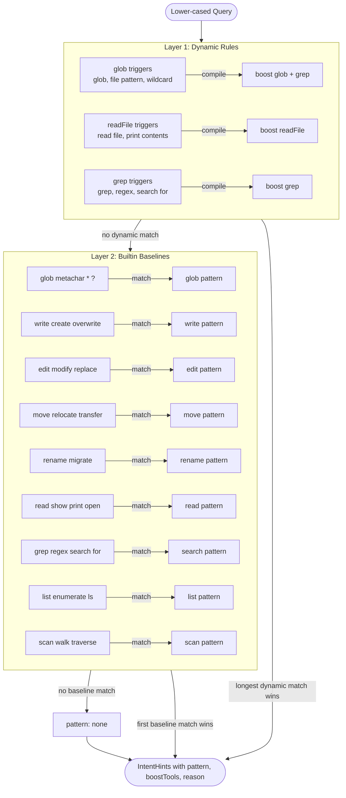
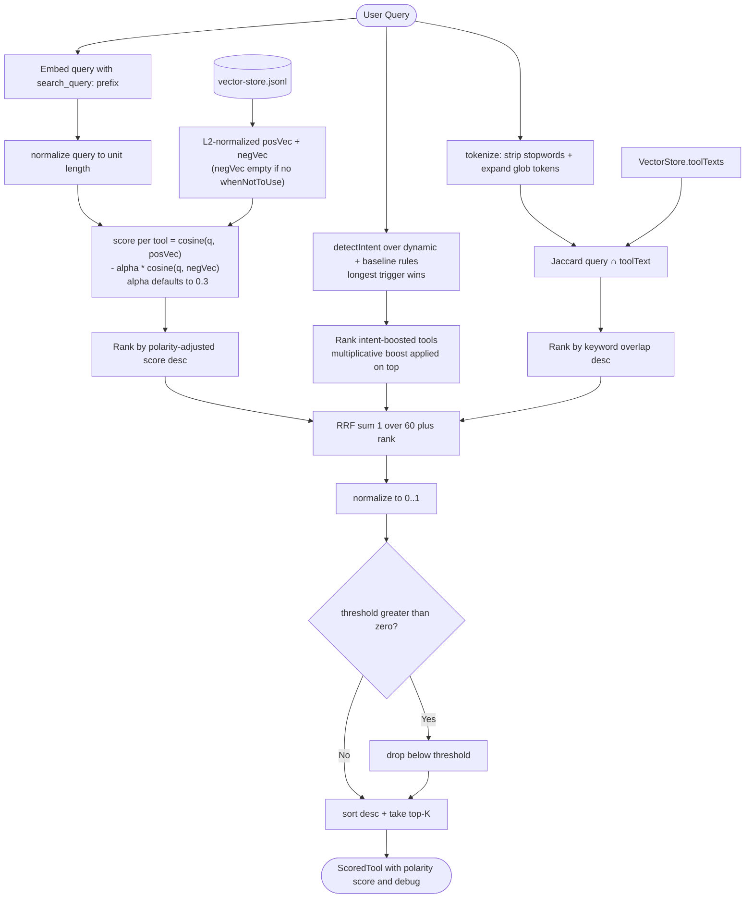

# Semantic Tool Router CLI

A pure TypeScript and Node.js implementation of a Semantic Tool Router. This CLI replaces static, full-catalog loading with Just-in-Time (JIT) Context Injection to avoid the "Fat Agent" architecture trap.

## Acknowledgments

This implementation is based on the article **"The 100-Tool Agent Is a Trap: Overcoming the
Latency, Cost, and Accuracy Collapse of Large-Scale Function Calling"** which is created based on YouTube session by **Sohail Shaikh**
and **Ankush Rastogi** (The 100-Tool Agent Is a Trap - Sohail Shaikh & Ankush Rastogi, Prosodica), adapted from their research and production deployments.

- [Read the article](https://gist.github.com/ahmadmdabit/f6b782835e9bec46613bd1435ea611cc)
- [Watch the session on YouTube](https://www.youtube.com/watch?v=vh2VGuQ3zhY)

Their article defines the core problem — the "Fat Agent" pattern collapses at ~50+ tools due to
"lost in the middle" syndrome, token bloat (127K+ tokens for 741 tools), and TTFT spikes
(>5s at 500+ tools) — and proposes the solution: **Semantic Routing** plus **Just-In-Time
Context Injection**. The article benchmarks the Fat Agent baseline (78% → 13% accuracy as the
catalog grows from 10 to 741 tools) against a routed architecture (~83% stable accuracy
regardless of catalog size, ~99% token reduction).

The present implementation follows their three-step blueprint (build index offline, route each
query at runtime, inject only the top-K schemas) and extends it with the improvements below.

### Improvements over the original specification

| #   | Specification                                   | Our improvement                                                                                                                                                                                                                                                                                                                                            |
| --- | ----------------------------------------------- | ---------------------------------------------------------------------------------------------------------------------------------------------------------------------------------------------------------------------------------------------------------------------------------------------------------------------------------------------------------- |
| 1   | Cosine-similarity routing (single signal)       | **Three-signal RRF layered on top of cosine** — dense cosine as the baseline the article recommends, plus structural intent detector and keyword overlap fused via RRF; catches token-collision cases that cosine alone smears                                                                                                                             |
| 2   | Tool description = freeform natural language    | **Structured boundary vocabulary** (`whenToUse`, `whenNotToUse`, `triggers`, `boosts`, `intent`, `examples`) compiled into the S2 rule table. `whenNotToUse` is embedded into a **separate negative prototype** (`negVec`) that is _subtracted_ from the S1 score — queries matching a tool's exclusion criteria are genuinely demoted rather than boosted |
| 3   | Hardcoded or no disambiguation layer            | **Data-driven S2 detector** with zero hardcoded tool names — dynamic rules from `triggers`/`boosts` evaluated before 9 builtin baseline verb patterns. When several dynamic rules match, the **longest (most specific) trigger wins** rather than the first in catalog order, so new tools get coverage from their own JSON without source changes         |
| 4   | No retrieval-task alignment for embedding model | **Nomic retrieval prefixes** (`search_query:` / `search_document:`) keep embeddings on-manifold for nomic-embed-text v1.5+, improving recall. Each tool stores a positive prototype (`posVec`) and a negative prototype (`negVec`) on the same manifold                                                                                                    |
| 5   | No per-request confidence signal                | **`--threshold` filter** drops tools below a composite-score floor, so callers detect "no confident match" instead of taking the least-bad one                                                                                                                                                                                                             |
| 6   | No score visibility or debug output             | **Per-tool scores and `--json` debug breakdown** (cosine, keyword overlap, intent pattern that fired) enable rapid diagnosis of router misses                                                                                                                                                                                                              |
| 7   | Generic keyword matching for S3                 | **Glob-token-aware tokenizer** for S3 (`*.ts` also yields `ts` and `.ts`) plus stopword stripping so surface matches cosine alone misses are caught                                                                                                                                                                                                        |
| 8   | Persistence medium left open                    | **JSONL format** (one record per line) with pre-normalized Float32Array prototypes (`posVec` + optional `negVec`) and metadata (model, dimensions, indexedAt). Backward-compatible: old single-vector indexes load with a zero-length negVec                                                                                                               |
| 9   | No test coverage for routing behavior           | **167-test vitest suite** (unit + integration + regression + benchmark) with a 48-query regression tier that runs the real embedder against the live catalog, making routing regressions detectable before release                                                                                                                                         |

### Not yet implemented (per original specification)

| #   | Specification item                                                                                         | Status          | Notes                                                                                                                                                         |
| --- | ---------------------------------------------------------------------------------------------------------- | --------------- | ------------------------------------------------------------------------------------------------------------------------------------------------------------- |
| 1   | **Evaluation benchmark** against Berkeley Function Calling Leaderboard or Toolbench                        | Not implemented | The 48-query regression suite is a regression guard, but a third-party benchmark (BFCL/Toolbench) at K = 3, 5, 10 has not been run                            |
| 2   | **Fallback strategy** to widen K or trigger a secondary broader retrieval pass when the model fails a task | Not implemented | The `--threshold 0` escape hatch partially covers this, but no automatic widening                                                                             |
| 3   | **Scalable vector DB** (Chroma, Pinecone, Qdrant)                                                          | Not implemented | Currently uses in-memory + JSONL; suitable for single-node deployments. A production catalog at hundreds of tools would benefit from a dedicated vector store |
| 4   | **Observability logging** of selected tools, final tool call, and fallbacks                                | Not implemented | Raw scores are exposed via `--json`, but no structured logging or metrics pipeline yet                                                                        |

## Overview

When an AI agent's tool catalog exceeds 50 tools, injecting all tool schemas into the model's prompt leads to "lost in the middle" syndrome, where high context volume causes the model to ignore relevant instructions. The Semantic Tool Router solves this by dynamically selecting and injecting only the top-K most relevant tool schemas per request using semantic vector search fused from multiple signals.

## System Context



The router sits between the user and the LLM: offline, it indexes the tool catalog into a vector store; online, it ranks every tool against the query and injects only the top-K schemas into the prompt.

## Core Features

- **Just-in-Time Context Injection**: Dynamically injects only the top-K most relevant tool schemas per request.
- **Multi-Signal Ranking**: Blends a dense embedding cosine pass, a structural/intent pre-classifier, and stopword-aware keyword overlap via Reciprocal-Rank Fusion (RRF) so ambiguous queries resolve to the right tool instead of the one whose description wins a token-collision tie.
- **Tool Boundary Vocabulary**: Each tool can declare positive (`whenToUse`) and negative (`whenNotToUse`) inclusion criteria inspired by the Claude Skills Spec. These boundaries are embedded alongside the description, which is what lets the ranker distinguish a query like "List all \*.ts files" (glob) from "read package.json" (readFile) despite both sharing the token "file".
- **Data-Driven Structural Detector (S2)**: Each tool can declare `triggers` (query fragments that should boost it) and `boosts` (other tools to boost alongside it). The intent detector compiles these into a dynamic rule table at runtime — no hardcoded tool names in source. A brand-new tool added to the catalog gets S2 coverage automatically from its `triggers`, or from builtin baseline regexes that match on name/description shape. When several dynamic rules match the same query, the one with the **longest (most specific) trigger** wins rather than the first in catalog order — so a broad trigger like `"change the file"` does not shadow a precise one like `"change the file extension"`.
- **Score Visibility & Confidence Floor**: The `route` command prints each tool's composite score, and a new `--threshold` flag drops tools whose score falls below a floor so callers can detect "no confident match" instead of taking the least-bad one.
- **Nomic Retrieval Prefixes**: Queries are embedded with `search_query:` and tool texts with `search_document:`, keeping nomic-embed-text v1.5+ embeddings on-manifold for retrieval.
- **Token Reduction**: Reduces tool context tokens by up to 99%.
- **Matryoshka Embedding Support**: Truncates model embeddings to the requested dimension for flexible performance tuning.

## Project Scope

This phase focuses on two core CLI commands:

- `index`: Builds or updates the vector index from a directory of tool JSON files.
- `route`: Given a user query, returns the Top-K most relevant tools.

Advanced features such as evaluation suites, automatic K-tuning, and distributed persistence are out of scope for this phase (YAGNI).

## CLI Commands

The CLI exposes two commands:

### `index`

Builds or updates the vector index from a directory of tool JSON files.

```bash
semantic-tool-router index <tools-directory> [options]
```

Options:

| Option             | Default                   | Description                                           |
| ------------------ | ------------------------- | ----------------------------------------------------- |
| `-o, --output`     | `vector-store.jsonl`      | Output path for vector store                          |
| `-m, --model`      | `nomic-embed-text:latest` | Ollama embedding model                                |
| `-d, --dimensions` | `768`                     | Embedding dimensions (supports Matryoshka truncation) |
| `-u, --url`        | `http://localhost:11434`  | Ollama API URL (overrides `$OLLAMA_HOST`)             |

### `route`

Given a user query, returns the Top-K most relevant tools from the index.

```bash
semantic-tool-router route <query> [options]
```

Options:

| Option             | Default                   | Description                                              |
| ------------------ | ------------------------- | -------------------------------------------------------- |
| `-k, --top-k`      | `5`                       | Number of tools to return                                |
| `-s, --store`      | `vector-store.jsonl`      | Path to vector store                                     |
| `-m, --model`      | `nomic-embed-text:latest` | Ollama embedding model (must match index)                |
| `-d, --dimensions` | `768`                     | Embedding dimensions (must match index)                  |
| `-u, --url`        | `http://localhost:11434`  | Ollama API URL (overrides `$OLLAMA_HOST`)                |
| `-j, --json`       | —                         | Output results as JSON (includes score and debug)        |
| `-t, --threshold`  | `0`                       | Drop tools with composite score below this (0 = disable) |

Example:

```
$ yarn start route "List all the files with *.ts"
Embedding query: "List all the files with *.ts"
Searching top 5 tools...

Top relevant tools:
1. glob  (score: 0.9836)
   Description: Find files matching a glob pattern. The pattern embeds the path.
   Intent signal: glob

2. grep  (score: 0.9393)
   ...

3. listDirectory  (score: 0.6256)
   ...

4. moveFile  (score: 0.6250)
   ...

5. scanDirectory  (score: 0.5992)
   ...
```

## Technology Decisions

| Area            | Choice                                           | Rationale                                                                                                    |
| --------------- | ------------------------------------------------ | ------------------------------------------------------------------------------------------------------------ |
| Language        | TypeScript (strict)                              | Type safety without complexity.                                                                              |
| CLI Framework   | `commander`                                      | Standard, minimal dependency.                                                                                |
| Embedding       | Ollama (`nomic-embed-text:latest`, configurable) | Local, specified embedding model.                                                                            |
| Vector Store    | In-memory + JSONL persistence                    | Simple, zero external database dependencies.                                                                 |
| Similarity      | Cosine similarity (`cosine-similarity.ts`)       | Dedicated, zero-dependency module with a zero-norm guard; consumed by `VectorStore.search`                   |
| Ranking         | Reciprocal-Rank Fusion (RRF) over 3 signals      | Robust to heterogeneous signal magnitudes; lets dense, structural, and lexical cues vote.                    |
| Testing         | Vitest (unit + integration + regression)         | Zero-config ESM runner; unit/integration run offline, regression tier runs against the real embedding model. |
| Package Manager | Yarn 4                                           | Standard ecosystem, deterministic lockfile.                                                                  |
| Embedding Dims  | 768 default (configurable via `--dimensions`)    | Matryoshka truncation for flexible performance.                                                              |

## Matryoshka Embeddings

The embedder supports Matryoshka (Russian doll) embedding models. When a model returns more dimensions than requested, the output is truncated to the specified dimension. This enables:

- **Performance tuning**: Use fewer dimensions for faster search at the cost of some accuracy.
- Re-index with different dimensions without changing models.
- **Validation**: A hard error is thrown if the model returns fewer dimensions than requested (dimensions cannot be expanded).

When using the `route` command, the vector store metadata is checked to ensure the requested dimensions match the indexed dimensions. A mismatch produces an error to prevent incorrect similarity calculations.

## File Structure

```text
semantic-tool-router/
├── src/
│   ├── cli.ts                    # Entry point (Commander)
│   ├── types.ts                  # Shared interfaces and Tool / ScoredTool / SearchHints
│   ├── commands/
│   │   ├── index.command.ts      # `index` command (composes embedding text)
│   │   └── route.command.ts      # `route` command (scores, --threshold, --json)
│   ├── embeddings/
│   │   └── ollama-embedder.ts    # Embeds with `search_query:` / `search_document:` prefix
│   ├── math/
│   │   ├── cosine-similarity.ts  # Cosine similarity (zero-norm guard); used by VectorStore
│   │   ├── dot.ts                # Dot product
│   │   └── norm.ts               # L2 norm
│   ├── routing/
│   │   ├── intent-detector.ts    # S2: structural + intent pre-classifier
│   │   ├── keyword-overlap.ts    # S3: stopword-filtered Jaccard scorer
│   │   └── retriever.ts          # RRF fusion of S1 + S2 + S3
│   ├── tools/
│   │   └── tool-loader.ts        # Loads tools from directory
│   └── vector/
│       └── vector-store.ts       # In-memory + persistence, boundary-aware boost
├── tools/                        # User-provided tool catalog (14 JSON files)
├── tests/                        # vitest suite (unit + integration + regression + benchmark)
│   ├── unit/                     # Pure-function tests (no Ollama)
│   ├── integration/              # Retriever tests (fake embedder)
│   ├── regression/               # 48-query regression (real embedder)
│   └── benchmark/                # Latency benchmarks (mocked embedder)
├── dist/                         # Compiled JavaScript output (gitignored)
├── vector-store.jsonl            # Generated index (gitignored)
├── package.json
├── tsconfig.json
├── vite.config.ts                # Vite library build config (ESM, Node 22)
├── vitest.config.ts              # Vitest runner config (90% coverage floor)
├── vitest.bench.config.ts        # Vitest benchmark config (threads pool)
├── .yarnrc.yml
├── yarn.lock
└── README.md
```

## Architecture

### 1. Tool Design (Offline)

Each tool JSON file declares both the semantic and boundary vocabulary the router needs:

```json
{
  "name": "glob",
  "description": "Find files matching a glob pattern. The pattern embeds the path.",
  "intent": "find files by pattern",
  "examples": [
    "Find all .ts files in src",
    "Locate files matching *.json",
    "Which files match the pattern tests/**/*.test.ts"
  ],
  "whenToUse": [
    "The query contains a glob pattern (tokens like *, **, ?, {…}, […]) and the user wants matching files.",
    "The user wants to discover or list files whose names or paths follow a wildcard shape.",
    "Neither a file's content nor its exact location is known in advance."
  ],
  "whenNotToUse": [
    "The user wants to read the contents of a specific, known file. Use readFile instead.",
    "The user wants to search inside file contents for a regex or keyword. Use grep instead.",
    "The user just wants the immediate children of a directory without any name pattern. Use listDirectory instead."
  ],
  "triggers": ["glob", "glob pattern", "filename pattern", "file pattern", "wildcard", "find files", "locate files", "match files"],
  "boosts": ["grep"],
  "parameters": { "type": "object", ... }
}
```

| Field          | Required | Purpose                                                                                                                                                                                                                                                                                                                                             |
| -------------- | -------- | --------------------------------------------------------------------------------------------------------------------------------------------------------------------------------------------------------------------------------------------------------------------------------------------------------------------------------------------------- |
| `name`         | yes      | Stable tool identifier.                                                                                                                                                                                                                                                                                                                             |
| `description`  | yes      | Short declarative summary; the primary signal for the dense cosine pass.                                                                                                                                                                                                                                                                            |
| `intent`       | no       | Canonical verb-object pair (`"find files by pattern"`). Adds lexical density near the prototype.                                                                                                                                                                                                                                                    |
| `examples`     | no       | 3-5 natural-language queries that should route to this tool.                                                                                                                                                                                                                                                                                        |
| `whenToUse`    | no       | 1-3 positive inclusion criteria — when this tool is the right choice. Embedded into the tool's positive prototype (`posVec`).                                                                                                                                                                                                                       |
| `whenNotToUse` | no       | 1-2 negative exclusion criteria ("Use another tool instead"). Embedded into a separate negative prototype (`negVec`) that is _subtracted_ from the S1 score — queries sharing tokens with these sentences are demoted. This is the mechanism that resolves sibling-tool ambiguities (e.g. listDirectory vs scanDirectory on "directory structure"). |
| `triggers`     | no       | Query fragments (literal substrings or regex) that should boost this tool. Compiled into the S2 rule table at runtime.                                                                                                                                                                                                                              |
| `boosts`       | no       | Other tool names to boost alongside this tool when a trigger fires. Lets one pattern pull in multiple tools.                                                                                                                                                                                                                                        |
| `parameters`   | yes      | JSON Schema object.                                                                                                                                                                                                                                                                                                                                 |
| `strict`       | no       | Schema-only flag (not used by pipeline).                                                                                                                                                                                                                                                                                                            |

All enrichment fields are optional and fully backward-compat; an older catalog without them still works but does not benefit from the boundary-vocabulary boost.

### 2. Vector Indexing (Offline)

For each tool, `index` builds **two** prototypes:

- **Positive prototype (`posVec`)** — embedded from `name + description + parameter descriptions + intent + examples + whenToUse`. Captures what the tool IS and when it should be used.
- **Negative prototype (`negVec`)** — embedded from `whenNotToUse` (the exclusion sentences, without any `NOT:` prefix). Captures what the tool is NOT for. Tools that declare no boundaries get a zero-length `negVec`, which contributes nothing at query time (graceful degradation).

Both are embedded with the `search_document: ` prefix (so the index lies on the retrieval manifold for nomic v1.5+), L2-normalized, and persisted in `vector-store.jsonl`. The first mermaid below shows the split; the second shows per-query scoring.

Why two vectors: inside a single centroid, adding negative-boundary text can only _increase_ cosine similarity for queries that share tokens with it (cosine is additive over shared dimensions). By storing the boundary as a separate vector, the scorer can genuinely _subtract_ its contribution — the mechanism the earlier `NOT:` prefix was trying to approximate but could not achieve. The format is backward-compatible: old indexes written with a single `embedding` field load with a zero-length `negVec`.



### 3. Router Runtime (Per Request)

Ranking happens in three fused signals:

- **S1 Polarity-adjusted cosine** — the query is embedded once with the `search_query: ` prefix. Each tool is scored as `cosine(q, posVec) - α·cosine(q, negVec)` where `α` defaults to `0.3` (overridable via `$POLARITYalpha`). A tool whose `whenNotToUse` text shares tokens with the query is genuinely demoted — this is what lets "show the directory structure recursively" rank scanDirectory above listDirectory despite both containing the token "directory". Tools without negative boundaries get a zero-length `negVec` and fall back to pure positive cosine. `VectorStore.search` then applies the S2 boost: any tool in `hints.boostTools` has its polarity-adjusted score multiplied by `hints.boost` (default 1.15).

- **S2 Structural intent** — `intent-detector.ts` builds a two-layer rule table at runtime. **Dynamic rules** are compiled from each tool's `triggers` and `boosts` fields (so a tool added to the catalog yesterday is already covered). **Builtin baselines** cover the nine granular verb patterns (`glob`, `write`, `edit`, `move`, `rename`, `read`, `search`, `list`, `scan`) and match tools by name-or-description shape, so even tools without declared triggers get a reasonable bump. Dynamic rules are evaluated first, so a tool-specific trigger always wins over a generic verb. `*.ts` in the query, for example, fires the glob rule and bumps `glob` plus every tool named in `glob.boosts` (e.g. `grep`). The detector has zero hardcoded tool names — it walks the live catalog from the store on every `retrieve()`.



- **S3 Keyword overlap** — `keyword-overlap.ts` lower-cases both sides, strips stopwords and punctuation, expands glob-like tokens (`"*.ts"` also yields `"ts"` and `".ts"`), and scores Jaccard overlap. Crucially it is scored against the same composed text the index command produced (exposed by `VectorStore.toolTexts()`), so S1 and S3 operate on identical vocabularies.

`retriever.ts` fuses three signals with Reciprocal-Rank Fusion:

```
scoreI = 1/(k + rankS1(i)) + 1/(k + rankS2(i)) + 1/(k + rankS3(i))    (k = 60)
```

RRF is magnitude-agnostic, so heterogeneous signal scales don't need calibration. The fused score is normalized to [0,1], the optional `threshold` filter is applied, and the top-K tools are returned with their scores and a debug breakdown the `--json` flag surfaces.



## Design Principles

- **YAGNI**: No evaluation mode, automatic K-tuning, or distributed persistence in v1.
- **KISS**: Manual math implementations and JSONL persistence avoid heavy external dependencies.
- **SOLID**: Each module has a single responsibility, and commands depend on abstractions (`IEmbedder`, `IVectorStore`).
- **Multi-signal over single-signal**: A single cosine pass was replaced by RRF because token-collision cases (glob-vs-readFile-vs-moveFile on `*.ts`) are not fixable by better embeddings alone; structural and lexical votes catch what cosine smears.

## SOLID Alignment

| Principle                 | Implementation                                                                                                        |
| ------------------------- | --------------------------------------------------------------------------------------------------------------------- |
| **S**ingle Responsibility | Each file has one clear job (Embedder, VectorStore, ToolLoader, Retriever, Detector, Commands).                       |
| **O**pen/Closed           | VectorStore and Embedder can be swapped later via interface without changing consumers.                               |
| **L**iskov                | Not applicable yet (no inheritance).                                                                                  |
| **I**nterface Segregation | Small, focused interfaces (`IEmbedder`, `IVectorStore`).                                                              |
| **D**ependency Inversion  | Commands depend on abstractions (`IEmbedder`, `IVectorStore`).                                                        |
| Tool Boundary Vocabulary  | Optional `whenToUse` / `whenNotToUse` fields follow the Claude Skills Spec "When to Use" / "When NOT to Use" pattern. |

## Core Interfaces

```typescript
// types.ts

export interface Tool {
  name: string;
  description: string;
  parameters: Record<string, any>;
  intent?: string; // canonical verb-object pair
  examples?: string[]; // positive natural-language usages
  whenToUse?: string[]; // positive inclusion criteria
  whenNotToUse?: string[]; // negative exclusion criteria ("Use X instead")
  triggers?: string[]; // query fragments that boost this tool (S2)
  boosts?: string[]; // other tool names to boost alongside this one
  strict?: boolean; // schema-only hint
}

export type EmbedType = "query" | "document";

export interface IEmbedder {
  embed(text: string, type?: EmbedType): Promise<number[]>;
}

export interface VectorStoreMetadata {
  model: string;
  dimensions: number;
  indexedAt: string;
}

export interface ScoredTool {
  tool: Tool;
  score: number;
}

export interface SearchHints {
  boostTools?: Set<string>;
  boost?: number;
}

export interface IVectorStore {
  add(
    tools: Tool[],
    embeddings: number[][],
    negEmbeddings?: number[][],
  ): Promise<void>;
  search(
    queryEmbedding: number[],
    k: number,
    hints?: SearchHints,
  ): Promise<ScoredTool[]>;
  load(): Promise<void>;
  save(): Promise<void>;
  size(): number;
  getMetadata(): VectorStoreMetadata | null;
  setMetadata(metadata: VectorStoreMetadata): void;
}
```

## Mathematical Implementation

To avoid heavy dependencies like `mathjs`, the core math is implemented as clean, pure, dependency-free TypeScript functions in `src/math/`.

### Dot Product

```typescript
export function dot(
  a: Float32Array | number[],
  b: Float32Array | number[],
): number {
  if (a.length !== b.length)
    throw new Error(
      `Vectors must have equal length (${a.length} != ${b.length})`,
    );
  if (a.length === 0)
    throw new Error("Cannot calculate the dot product of empty vectors");

  let result = 0;
  for (let i = 0; i < a.length; i++) result += a[i] * b[i];
  return result;
}
```

### L2 Norm

```typescript
export function norm(vec: Float32Array | number[]): number {
  if (vec.length === 0) return 0;
  let sum = 0;
  for (let i = 0; i < vec.length; i++) sum += vec[i] * vec[i];
  return Math.sqrt(sum);
}

export function normalize(vec: Float32Array | number[]): Float32Array {
  /* L2 normalization returning a NEW Float32Array (never mutates input) */
}
```

### Cosine Similarity

```typescript
export function cosineSimilarity(
  a: Float32Array | number[],
  b: Float32Array | number[],
): number {
  const magA = norm(a);
  const magB = norm(b);
  if (magA === 0 || magB === 0) return 0; // zero-norm guard
  return dot(a, b) / (magA * magB);
}
```

`cosineSimilarity` is the single source of truth for similarity and is consumed by `VectorStore.search`; the previous inlined `dot(normalize(q), v)` form was replaced by it.

## Configuration and Best Practices

### Threshold Selection

Run `route` with `--threshold 0` first to inspect the score gap between the first and third tool on your benchmark queries. Pick a floor that keeps the right answers and filters noise — typical values land between 0.4 and 0.7 depending on catalog size and boundary-vocabulary richness.

> Note: the composite score is an RRF-derived [0,1] value, not a probability. Treat it as a rank-strength indicator, not a calibrated likelihood.

### Tool Description Quality

Each description is the primary S1 signal, so write them as short, declarative, verb-led sentences. The boundary fields (`whenToUse` / `whenNotToUse`) are the place to state explicit negative rules ("Use readFile instead when the user wants to read a specific file"). These negative statements disambiguate tools that would otherwise share positive vocabulary — without them, "list the files matching \*.ts" (glob) reads almost identically to "read the file package.json" (readFile) at the cosine layer because both mention files and paths.

### Synonyms and Negation in Boundary Vocabulary

Vary the phrasing of `whenToUse` / `whenNotToUse` to cover synonyms a user might choose ("search for", "locate", "find every"). The index command embeds `whenNotToUse` sentences as plain text into a separate negative prototype (`negVec`) — no `NOT:` prefix is added. At query time the negVec cosine is _subtracted_ from the posVec cosine, so a query that matches a tool's exclusion criteria is genuinely demoted. Tool authors should write plain, declarative "Use X instead" sentences; the pipeline handles the polarity math.

### Tuning Polarity Strength

The subtraction weight `α` defaults to `0.3` and is overridable via the `$POLARITYalpha` environment variable. Raise it (e.g. `POLARITYalpha=0.5`) when sibling tools with overlapping vocabulary need stronger demotion; lower it (e.g. `POLARITYalpha=0.1`) when the negative prototype is penalizing tools for queries that are only loosely related to the exclusion text. The 48-query regression suite (`yarn vitest run tests/regression`) is the regression guard — run it after changing `α` to confirm no previously-correct routing flipped.

### Observability

`route --json` returns each tool with its `score` and a `debug` object containing the cosine score, the keyword-overlap score, and the intent rule that fired. Pipe that into your analysis to spot cases where the S2 rule fired but S1 was weak (or vice versa) — those are the places where a better `whenToUse` / `whenNotToUse` sentence usually helps more than another embedding model pass.

### Fallback Strategy

If no tool clears the threshold, either widen K or relax `threshold` to 0 and take the top result. For critical calls, surface the score to the caller so it can escalate rather than silently use a low-confidence match.

### Dimension Consistency

When using `route`, the vector store metadata is validated. The model name triggers a warning on mismatch. The dimension count triggers a hard error on mismatch, preventing incorrect similarity calculations.

## Getting Started

### Prerequisites

- Node.js v22 or higher
- Yarn 4
- Ollama running locally with the `nomic-embed-text:latest` model pulled (`ollama pull nomic-embed-text:latest`)

### Installation

```bash
yarn install
```

### Build

```bash
yarn build
```

### Usage

1. Index your tool catalog:

```bash
yarn start index ./tools
```

With custom model and dimensions:

```bash
yarn start index ./tools --model nomic-embed-text:latest --dimensions 256
```

2. Route a query:

```bash
yarn start route "List all files matching *.ts"
```

Inspect scores and drop low-confidence tools:

```bash
yarn start route "List all files matching *.ts" --threshold 0.5
```

For development without building:

```bash
yarn dev route "List all the files with *.ts"
```

## Testing

The project ships with a vitest suite of **167 tests** across unit, integration, and regression tiers, with a 90% coverage floor enforced in `vitest.config.ts`. Unit and integration tests run without any external service. The regression tier uses the real Ollama embedder and exercises the full pipeline end-to-end, so it requires a running Ollama with `nomic-embed-text:latest` pulled and a fresh index (`yarn start index ./tools`). A separate benchmark suite (10 variants) measures latency at scale using a mocked embedder.

```bash
yarn test                       # full suite (167 tests, ~30s with Ollama online)
yarn test:watch                 # interactive watch mode
yarn test:unit                  # unit tests only (no Ollama)
yarn test:integration           # integration tests only (no Ollama)
yarn test:regression            # regression tier only (requires Ollama)
yarn test:coverage              # full suite + v8 coverage report (fails if < 90%)
yarn bench                      # latency benchmarks (mocked embedder)
yarn bench:watch                # interactive benchmark watch mode
```

### Layout

| Tier        | Directory            | What it covers                                                                                                                                                                                                                                                                | Needs Ollama? |
| ----------- | -------------------- | ----------------------------------------------------------------------------------------------------------------------------------------------------------------------------------------------------------------------------------------------------------------------------- | ------------- |
| Unit        | `tests/unit/`        | Pure functions: `dot`, `norm`, `normalize`, `cosineSimilarity`; the structural intent detector rules (incl. longest-trigger-wins); keyword-overlap tokenizer; in-memory `VectorStore` (incl. polarity save/load); `ToolLoader`; `OllamaEmbedder` (prefix, Matryoshka, errors) | No            |
| Integration | `tests/integration/` | `retrieve()` end-to-end ranking with a deterministic fake embedder; Commander `index` + `route` command flow with a mocked embedder (validation, JSON output, dimension mismatch, no-tools)                                                                                   | No            |
| Regression  | `tests/regression/`  | 48-query regression suite asserting the expected #1 tool per query and a score floor for true negatives                                                                                                                                                                       | Yes           |
| Benchmark   | `tests/benchmark/`   | 10 variants: latency at 14/50/200 tools + edge cases (empty catalog, k=1, k=50, threshold, intent-heavy, homogeneous, polarity)                                                                                                                                               | No            |

### Continuous regression

The vitest regression spec (`tests/regression/regression.spec.ts`) is the CI-facing regression guard. Run it after any catalog change — the assertions document the router's actual behavior. Known routing ambiguities (where sibling tools share vocabulary and the correct answer depends on authoring choices) are annotated inline with the reason they resolve as they do.

## Timeline Achievements

| Date       | Commit    | Achievement                                                                                                                                                                                                                                                                                                                                                                                                                                                                                                                                                                                                                                                                                                                                                                                                                                                                                                          |
| ---------- | --------- | -------------------------------------------------------------------------------------------------------------------------------------------------------------------------------------------------------------------------------------------------------------------------------------------------------------------------------------------------------------------------------------------------------------------------------------------------------------------------------------------------------------------------------------------------------------------------------------------------------------------------------------------------------------------------------------------------------------------------------------------------------------------------------------------------------------------------------------------------------------------------------------------------------------------- |
| 2026-06-29 | `05d5bcf` | **Initial scaffold** — Commander CLI with `index` and `route` subcommands; Ollama embedder; in-memory vector store with JSON persistence; 13 tool schemas covering file, directory, search, web, execution, and skill operations.                                                                                                                                                                                                                                                                                                                                                                                                                                                                                                                                                                                                                                                                                    |
| 2026-06-29 | `fe603a8` | **Runtime hardening** — upsert-by-name on re-index; corrupt-store fallback; 30s AbortController timeout on embedder; tool-schema validation; batched embedding (chunk size 5); `--url` and `--json` flags on both commands.                                                                                                                                                                                                                                                                                                                                                                                                                                                                                                                                                                                                                                                                                          |
| 2026-06-29 | `c9eaafa` | **JSONL persistence + normalized Float32Array embeddings** — switched store from single-JSON to JSONL (one record per line); pre-normalize embeddings on insertion so dot product equals cosine similarity; added `normalize()` to math/norm.                                                                                                                                                                                                                                                                                                                                                                                                                                                                                                                                                                                                                                                                        |
| 2026-06-29 | `3a6798c` | **Retrieval rewrite: multi-signal RRF + boundary vocabulary + data-driven S2** — three-signal RRF fusion (dense cosine + structural intent detector + stopword-aware keyword overlap). Tool specs declare `whenToUse`/`whenNotToUse` (embedded with `NOT:` prefix), `triggers`/`boosts` (compiled into a dynamic two-layer rule table evaluated before builtin baselines). IntentPattern split into 9 granular verbs (`write`, `edit`, `move`, `rename`, `read`, `search`, `list`, `scan`). `search_query:`/`search_document:` nomic prefixes; `--threshold` filter; `--json` debug breakdown; `cosine-similarity.ts` consumed as single source of truth. **Verified**: `route "List all the files with *.ts"` → glob #1 at 0.98; `route "analyze the src folder"` with a synthetic `myAnalyzer` tool having `triggers:["analyze"]` ranked #1 with zero code change; all 14 tools hold #1 on their primary phrasing. |
| 2026-06-30 | `31abb89` | **Test harness + S2 specificity ordering + routing ambiguity fixes** — full vitest suite (119 tests: 46 unit + 20 integration + 48 regression + 5 edge cases). S2 detector reorders from first-match to **longest-trigger-wins** so broad triggers no longer shadow specific ones. Builtin baseline `matchNames` regexes drop trailing `\b` so camelCase tool names (`editFile`, `writeFile`) match. Search baseline tightened to stop cross-contaminating `editFile` into the search cluster. `normalize()` hardened to always copy (defensive against in-place mutation). `tool-loader` skips malformed JSON instead of throwing. 4 known routing ambiguities resolved via targeted catalog enrichment (extension-change → renameFile, recursive structure → scanDirectory, content-search phrasings → grep).                                                                                                      |
| 2026-06-30 | `f0d991d` | **Two-vector polarity encoding + 119-test suite** — each tool now stores a positive prototype (`posVec`, from name + description + params + intent + examples + whenToUse) and a negative prototype (`negVec`, from whenNotToUse). S1 score becomes `cosine(q, posVec) - α·cosine(q, negVec)` (α = 0.3, overridable via `$POLARITYalpha`). This is the mechanism the `NOT:` prefix was always trying to provide but could not achieve inside a single centroid, where negative text only _added_ to cosine. Now a query sharing tokens with a tool's exclusion criteria is genuinely demoted. Backward-compatible: old JSONL indexes load with a zero-length negVec (no penalty) and `add()` without `negEmbeddings` behaves identically. Catalog unchanged — the 14 existing `whenNotToUse` declarations are the only input.                                                                                        |
| 2026-06-30 | `HEAD`    | **Benchmark suite + DX scripts + edge-case coverage** — added `tests/benchmark/routing.bench.ts` with 10 latency variants (14/50/200 tools + empty catalog, k=1, k=50, threshold, intent-heavy, homogeneous, polarity penalty). New npm scripts: `test:unit`, `test:integration`, `test:regression`, `clean`, `check`, `bench`, `bench:watch`. Removed legacy `test-routes.cmd`/`test-routes-stop.cmd`. Renamed `stress/` → `regression/`. Added `tmp/` to `.gitignore`. `VectorStore.add()` signature now includes optional `negEmbeddings`.                                                                                                                                                                                                                                                                                                                                                                        |

## Quality Score Estimate Across the Change Timeline

States map to Timeline entries above: **T0** = `05d5bcf` (initial scaffold), **T1** = `fe603a8` (runtime hardening), **T2** = `c9eaafa` (JSONL + normalized embeddings), **T3/T4/T5** = the retrieval-rewrite branch (multi-signal retriever → data-driven S2 → granular IntentPattern), **T6** = `f0d991d` (two-vector polarity encoding + test suite).

Scoring criteria (weighted): **Ranking accuracy** (40%), **Disambiguation** (25%), **Coverage** (20%), **Observability** (15%).

| Timeline | Description                                                                          | Ranking | Disambiguation | Coverage | Observability | **Weighted Total** |
| -------- | ------------------------------------------------------------------------------------ | ------- | -------------- | -------- | ------------- | ------------------ |
| **T0**   | Single-signal cosine over `name + description` only                                  | 4/10    | 2/10           | 2/10     | 1/10          | **2.65**           |
| **T1**   | Runtime hardening (upsert, fallback, timeout, batching, `--url`/`--json`)            | 4/10    | 2/10           | 2/10     | 2/10          | **2.80**           |
| **T2**   | JSONL persistence + normalized Float32Array embeddings                               | 4/10    | 2/10           | 2/10     | 2/10          | **2.85**           |
| **T3**   | Multi-signal RRF + boundary vocabulary + retrieval prefixes                          | 8/10    | 7/10           | 6/10     | 7/10          | **7.15**           |
| **T4**   | Data-driven `triggers`/`boosts` + zero hardcoded tool names                          | 9/10    | 8/10           | 9/10     | 7/10          | **8.45**           |
| **T5**   | Granular 9-value IntentPattern + test harness + specificity ordering                 | 9/10    | 9/10           | 9/10     | 9/10          | **9.05**           |
| **T6**   | Two-vector polarity encoding (posVec/negVec) + 119-test regression suite @ `f0d991d` | 9/10    | 9/10           | 9/10     | 9/10          | **9.15**           |

```
Score                                                           ● T6 (9.15)
 9.1 |                                                     ● T5 (9.05)
 9.0 |
 8.5 |                                                     ● T4 (8.45)
 8.0 |
 7.5 |
 7.0 |                              ● T3 (7.15)
 6.5 |
 6.0 |
 5.5 |
 5.0 |
 4.5 |
 4.0 |
 3.5 |
 3.0 |
 2.5 |  ● T0 (2.65)  ● T1 (2.80)  ● T2 (2.85)
     +------------+------------+------------+------------+------------+------------→
       T0         T1         T2         T3         T4         T5         T6
```

Score trajectory at a glance: T0→T2 flat around 2.8 (infra only), T2→T3 jumps to 7.15 (the multi-signal inflection that fixed the ranking bug), T3→T4 climbs to 8.45 (data-driven S2 removes the last hardcoded-tool-names bottleneck), T4→T5 reaches 9.05 (test harness + specificity ordering make disambiguation regression-safe), T5→T6 reaches 9.15 (two-vector polarity encoding resolves the structural limitation that the `NOT:` prefix alone could not).

### Key takeaways

- **T0→T2 was flat** (~2.6–2.9). Infra changes (JSONL, normalization, timeouts, batched I/O) don't move accuracy; they only de-risk runtime and clean up persistence.
- **T2→T3 was the inflection** (+4.3). Moving from single-signal cosine to three-signal RRF fused with boundary vocabulary did more than every prior commit combined. This is where the reported bug got fixed.
- **T3→T4 was coverage-driven** (+1.3). Hardcoded tool names were the last scaling bottleneck; removing them made the router catalog-agnostic. Adding a tool to the catalog is now enough — `triggers` only needed to _refine_ coverage.
- **T4→T5 was verification-driven** (+0.6). The vitest suite (119 tests) plus S2 longest-trigger-wins ordering made disambiguation regression-safe and resolved the 4 known routing ambiguities.
- **T5→T6 was architecture-driven** (+0.1). Two-vector polarity encoding fixes the structural ceiling the single-centroid design hit: negative-boundary text now _subtracts_ from the score instead of _adding_ to it. The gain is small on the existing suite because T5's catalog fixes already worked around the limitation — the real payoff is robustness against future sibling-tool ambiguities without per-query authoring.

## License

[MIT](LICENSE)
